# Entity-Relationship Diagram

> Generated by the `docs-sync` agent from the live schema (Mermaid `erDiagram`).

```mermaid
erDiagram
    account {
        integer id PK "GENERATED ALWAYS AS IDENTITY"
        uuid user_id FK "NOT NULL, owner, immutable, ON DELETE RESTRICT"
        varchar name "NOT NULL, max 100"
        account_kind kind "NOT NULL"
        integer opening_balance "NOT NULL, default 0"
        integer cutoff_day "nullable, credit only"
        integer payment_day "nullable, credit only"
        integer credit_limit "nullable, credit only"
        boolean is_active "NOT NULL, default true"
        timestamptz created_at "NOT NULL, default now()"
        varchar bank "nullable, max 100, informative"
        varchar number "nullable, max 30, masked - never a full PAN"
        date expiration_date "nullable, normalized to day 1 of month"
    }

    expense_category {
        integer id PK "GENERATED ALWAYS AS IDENTITY"
        varchar name "NOT NULL, max 100"
        varchar description "nullable, max 300"
        boolean is_savings "NOT NULL, default false"
        boolean is_fixed "NOT NULL, default false, excl with is_savings"
        boolean is_active "NOT NULL, default true"
        timestamptz created_at "NOT NULL, default now()"
    }

    fixed_expense {
        integer id PK "GENERATED ALWAYS AS IDENTITY"
        uuid user_id FK "NOT NULL, owner, ON DELETE CASCADE"
        varchar name "NOT NULL, max 100"
        integer amount "NOT NULL, > 0, cents"
        integer account_id FK "NOT NULL, ON DELETE RESTRICT"
        integer expense_category_id FK "NOT NULL, ON DELETE RESTRICT"
        integer day_of_month "NOT NULL, 1..31"
        date start_date "NOT NULL"
        date end_date "nullable, >= start_date when set"
        boolean is_active "NOT NULL, default true"
        timestamptz created_at "NOT NULL, default now()"
        timestamptz updated_at "NOT NULL, default now()"
    }

    income_category {
        integer id PK "GENERATED ALWAYS AS IDENTITY"
        varchar name "NOT NULL, max 100"
        varchar description "nullable, max 300"
        boolean is_active "NOT NULL, default true"
        timestamptz created_at "NOT NULL, default now()"
    }

    income_schedule {
        integer id PK "GENERATED ALWAYS AS IDENTITY"
        uuid user_id FK "NOT NULL, ON DELETE CASCADE"
        varchar name "NOT NULL, max 100"
        income_frequency frequency "NOT NULL"
        integer estimated_amount "NOT NULL, > 0, centavos, projection only"
        integer account_id FK "NOT NULL, destination, ON DELETE RESTRICT"
        integer income_category_id FK "nullable, default category"
        date anchor_date "NOT NULL, anchors the recurrence series"
        boolean is_active "NOT NULL, default true"
        timestamptz created_at "NOT NULL, default now()"
        timestamptz updated_at "NOT NULL, default now()"
    }

    ledger_entry {
        integer id PK "GENERATED ALWAYS AS IDENTITY"
        uuid user_id FK "NOT NULL, denormalized from account.user_id, ON DELETE RESTRICT"
        ledger_entry_kind kind "NOT NULL"
        ledger_entry_status status "NOT NULL"
        integer amount "NOT NULL, > 0"
        varchar concept "nullable, max 200"
        timestamptz occurred_at "NOT NULL"
        timestamptz created_at "NOT NULL, default now()"
        timestamptz updated_at "NOT NULL, default now()"
        integer account_id FK "NOT NULL"
        integer to_account_id FK "nullable, transfer only"
        integer income_category_id FK "nullable, income entries only"
        integer expense_category_id FK "nullable, expense entries only"
        integer fixed_expense_id FK "nullable, expense only, ON DELETE SET NULL"
        date fixed_expense_month "nullable, day 1, paired with fixed_expense_id"
        integer expected_amount "nullable, income only, > 0"
    }

    plan {
        integer id PK "GENERATED ALWAYS AS IDENTITY"
        uuid user_id FK "NOT NULL, ON DELETE CASCADE"
        varchar name "NOT NULL, max 100"
        date period_start "NOT NULL"
        date period_end "NOT NULL, >= period_start"
        timestamptz created_at "NOT NULL, default now()"
    }

    budget {
        integer id PK "GENERATED ALWAYS AS IDENTITY"
        integer plan_id FK "NOT NULL"
        budget_subtype subtype "NOT NULL"
        integer target_amount "NOT NULL, > 0"
        date period_start "nullable, paired override"
        date period_end "nullable, paired override"
        integer expense_category_id FK "nullable, category_cap only"
        integer account_id FK "nullable, savings_reservation only"
        varchar item_name "nullable, purchase_goal only, max 100"
        purchase_horizon horizon "nullable, purchase_goal only"
        timestamptz created_at "NOT NULL, default now()"
    }

    profile {
        uuid user_id PK "FK auth.users.id, ON DELETE CASCADE"
        varchar username "NOT NULL, max 30, lower ci unique, only visible name"
        varchar login_email "NOT NULL, max 255, lower ci unique"
        boolean has_real_email "NOT NULL, default false"
        timestamptz email_verified_at "nullable, app-owned mailbox-possession proof"
        timestamptz created_at "NOT NULL, default now()"
        timestamptz updated_at "NOT NULL, default now()"
    }

    space {
        integer id PK "GENERATED ALWAYS AS IDENTITY"
        varchar name "NOT NULL, max 100"
        uuid created_by FK "nullable, ON DELETE SET NULL, informational"
        timestamptz created_at "NOT NULL, default now()"
    }

    space_member {
        integer space_id PK,FK "ON DELETE CASCADE"
        uuid user_id PK,FK "ON DELETE CASCADE"
        space_role role "NOT NULL, default member"
        timestamptz joined_at "NOT NULL, default now()"
    }

    space_account {
        integer space_id PK,FK "ON DELETE CASCADE"
        integer account_id PK,FK "ON DELETE CASCADE"
        uuid shared_by FK "NOT NULL, member who exposed the account"
        timestamptz shared_at "NOT NULL, default now()"
    }

    account ||--o{ ledger_entry : "account_id (source)"
    account ||--o{ ledger_entry : "to_account_id (transfer dest)"
    income_category ||--o{ ledger_entry : "income_category_id"
    expense_category ||--o{ ledger_entry : "expense_category_id"
    fixed_expense ||--o{ ledger_entry : "fixed_expense_id (set null)"
    account ||--o{ fixed_expense : "account_id (restrict)"
    expense_category ||--o{ fixed_expense : "expense_category_id (restrict)"
    account ||--o{ income_schedule : "account_id (destination, restrict)"
    income_category ||--o{ income_schedule : "income_category_id (optional)"
    plan ||--o{ budget : "plan_id (cascade)"
    expense_category ||--o{ budget : "expense_category_id (category_cap)"
    account ||--o{ budget : "account_id (savings_reservation)"
    profile ||--o| profile : "1:1 with auth.users (external)"
    profile ||--o{ account : "auth.users.id -> account.user_id (external)"
    profile ||--o{ plan : "auth.users.id -> plan.user_id (external)"
    profile ||--o{ ledger_entry : "auth.users.id -> ledger_entry.user_id (external)"
    profile ||--o{ income_schedule : "auth.users.id -> income_schedule.user_id (external, cascade)"
    profile ||--o{ fixed_expense : "auth.users.id -> fixed_expense.user_id (external)"
    space ||--o{ space_member : "space_id (cascade)"
    space ||--o{ space_account : "space_id (cascade)"
    account ||--o{ space_account : "account_id (cascade)"
```

<!-- BEGIN GENERATED: erd -->

<!-- END GENERATED: erd -->

## Notes

- Enums: `account_kind` = (cash, debit, investment, credit); `income_frequency` =
  (weekly, biweekly, semimonthly, monthly); `ledger_entry_kind` =
  (income, expense, transfer); `ledger_entry_status` = (cleared, projected);
  `budget_subtype` = (category_cap, savings_reservation, purchase_goal);
  `purchase_horizon` = (short, medium, long); `space_role` = (owner, member).
- All foreign keys use `ON DELETE no action ON UPDATE no action`, except: `budget.plan_id` →
  `plan` (`cascade`); `account.user_id` → `auth.users` (`restrict`); `plan.user_id` →
  `auth.users` (`cascade`); `ledger_entry.user_id` → `auth.users` (`restrict`);
  `ledger_entry.fixed_expense_id` → `fixed_expense` (`set null`);
  `profile.user_id` → `auth.users` (`cascade`); `space.created_by` → `auth.users` (`set null`);
  `space_member.*` → `space`/`auth.users` (`cascade`); `space_account.space_id`/`account_id` →
  `space`/`account` (`cascade`); `income_schedule.user_id` → `auth.users` (`cascade`);
  `income_schedule.account_id` → `account` (`restrict`); `fixed_expense.user_id` → `auth.users`
  (`cascade`); `fixed_expense.account_id`/`expense_category_id` → `account`/`expense_category`
  (`restrict`).
- `auth.users` is a Supabase-managed table outside `public` (declared in Drizzle only so
  `public` tables can FK to it; `drizzle-kit` never manages it — see `schemaFilter: ["public"]`
  in `drizzle.config.ts`). The `profile ||--o{ ...` edges above are drawn from `profile` as a
  stand-in for `auth.users` since Mermaid can't reference an external table directly; the real FK
  target is always `auth.users.id`, not `profile.user_id`.
- A `space` is a **visibility overlay**, never an owner: `account.user_id` is the sole owner of an
  account and is immutable after creation. `space_account` only records that a member exposed one
  of their accounts to a space; a space's balance is the sum of its exposed accounts' balances.
- `ledger_entry.user_id` is denormalized from `account.user_id`, copied at write time by
  `ledger-write` (not by a DB trigger — the schema stays declarative). Cross-user transfers
  (`to_account_id` owned by a different user) are rejected in `ledger-write`, not by a DB
  constraint.
- `income_schedule` (migration `0010_lovely_princess_powerful`) holds recurring-income config (payroll etc.). Occurrences
  are computed **in memory** from `frequency` + `anchor_date` (`semimonthly` = day 15 and last day
  of month) and are never materialized; on payday the app asks for the real amount and writes a
  `ledger_entry` (`kind = income`, `status = cleared`) — deliberately **no FK** between
  `ledger_entry` and `income_schedule`, so the schedule has no incoming relationships.
  `estimated_amount` (centavos) only feeds projections.
- RLS is enabled on all 12 `public` tables but **no per-user policies exist yet** — isolation is
  enforced entirely in the server-action/repo layer (`WHERE user_id = session.userId`). Every
  table has exactly one policy, `<table>_select_mcp_readonly FOR SELECT USING (true)`, scoped to
  the `mcp_readonly` role used by the `db` MCP.
- A `budget` is polymorphic by `subtype` (enforced by `chk_budget_subtype_fields`):
  `category_cap` sets `expense_category_id`; `savings_reservation` sets `account_id`;
  `purchase_goal` sets `item_name` + `horizon`. The other subtype-specific columns stay NULL.
- `budget.period_start`/`period_end` are an optional paired window override (enforced by
  `chk_budget_period_pair`); when both NULL the budget inherits the plan's period.
- At most one `category_cap` per (`plan_id`, `expense_category_id`) and one
  `savings_reservation` per (`plan_id`, `account_id`) via partial unique indexes
  `budget_cap_category_uq` and `budget_reservation_account_uq`.
- `to_account_id` is populated only for `transfer` entries (enforced by `chk_transfer_to_account`).
- `income_category_id` and `expense_category_id` are mutually exclusive by entry kind (enforced by
  `chk_category_kind`). Transfer entries leave both NULL.
- `expense_category` has at most one row with `is_savings = true` (partial unique index
  `expense_category_savings_singleton`). Categories are global catalogs (no `user_id`).
  `is_fixed = true` marks fixed-expense categories (seeded: "Servicios", "Subscripciones");
  `is_savings` and `is_fixed` are mutually exclusive (`chk_expense_category_savings_fixed_excl`).
- `fixed_expense` is a per-user monthly recurring-expense template (integer cents). A ledger
  expense may link to it via `fixed_expense_id` + `fixed_expense_month` (day 1 of the covered
  month, `chk_fixed_expense_month_day1`); the link requires `kind = 'expense'` and a month
  (`chk_fixed_expense_link`), and at most one entry per template per month exists (partial unique
  index `uq_ledger_entry_fixed_expense_month`). Deleting a template detaches its entries
  (`ON DELETE SET NULL`); its `account_id`/`expense_category_id` FKs are `RESTRICT`.
- `ledger_entry.expected_amount` (income entries only, `> 0` when set,
  `chk_expected_amount_income`) stores the projected amount for projected-vs-actual comparison.
- `profile.login_email` mirrors `auth.users.email` — the value actually passed to
  `signInWithPassword`. It is synthetic (`<username>@users.perfin.internal`,
  `has_real_email = false`) when the user registered without a real email.
- `account.bank`/`number`/`expiration_date` must be NULL when `kind = 'cash'` (enforced by
  `chk_cash_no_bank_fields`, migration `0007`) — `cash` is a physical account, never a bank
  product (ADR-009); `debit`/`investment` may still carry these fields freely.
