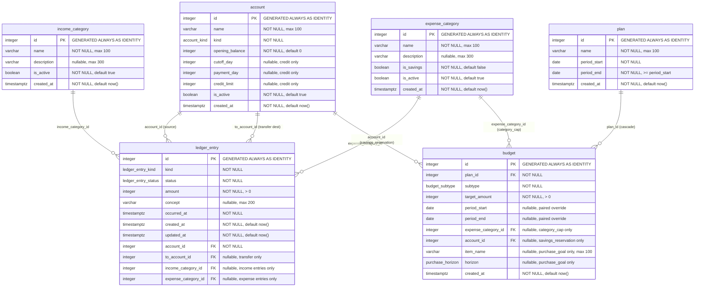

# Entity-Relationship Diagram

> Generated by the `docs-sync` agent from the live schema (Mermaid `erDiagram`).

<!-- BEGIN GENERATED: erd -->

<!-- END GENERATED: erd -->

## Notes

- Enums: `account_kind` = (cash, debit, investment, credit); `ledger_entry_kind` =
  (income, expense, transfer); `ledger_entry_status` = (cleared, projected);
  `budget_subtype` = (category_cap, savings_reservation, purchase_goal);
  `purchase_horizon` = (short, medium, long).
- All foreign keys use `ON DELETE no action ON UPDATE no action`, except `budget.plan_id` →
  `plan` which is `ON DELETE cascade`.
- A `budget` is polymorphic by `subtype` (enforced by `chk_budget_subtype_fields`):
  `category_cap` sets `expense_category_id`; `savings_reservation` sets `account_id`;
  `purchase_goal` sets `item_name` + `horizon`. The other subtype-specific columns stay NULL.
- `budget.period_start`/`period_end` are an optional paired window override (enforced by
  `chk_budget_period_pair`); when both NULL the budget inherits the plan's period.
- At most one `category_cap` per (`plan_id`, `expense_category_id`) and one
  `savings_reservation` per (`plan_id`, `account_id`) via partial unique indexes
  `budget_cap_category_uq` and `budget_reservation_account_uq`.
- `to_account_id` is populated only for `transfer` entries (enforced by `chk_transfer_to_account`).
- `income_category_id` and `expense_category_id` are mutually exclusive by entry kind (enforced by
  `chk_category_kind`). Transfer entries leave both NULL.
- `expense_category` has at most one row with `is_savings = true` (partial unique index
  `expense_category_savings_singleton`).
