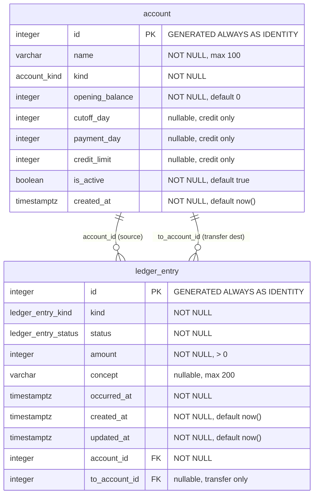

# Entity-Relationship Diagram

> Generated by the `docs-sync` agent from the live schema (Mermaid `erDiagram`).

<!-- BEGIN GENERATED: erd -->

<!-- END GENERATED: erd -->

## Notes

- Enums: `account_kind` = (cash, debit, investment, credit); `ledger_entry_kind` =
  (income, expense, transfer); `ledger_entry_status` = (cleared, projected).
- Both foreign keys (`account_id`, `to_account_id`) reference `account.id` with
  `ON DELETE no action ON UPDATE no action`.
- `to_account_id` is populated only for `transfer` entries (enforced by `chk_transfer_to_account`).
